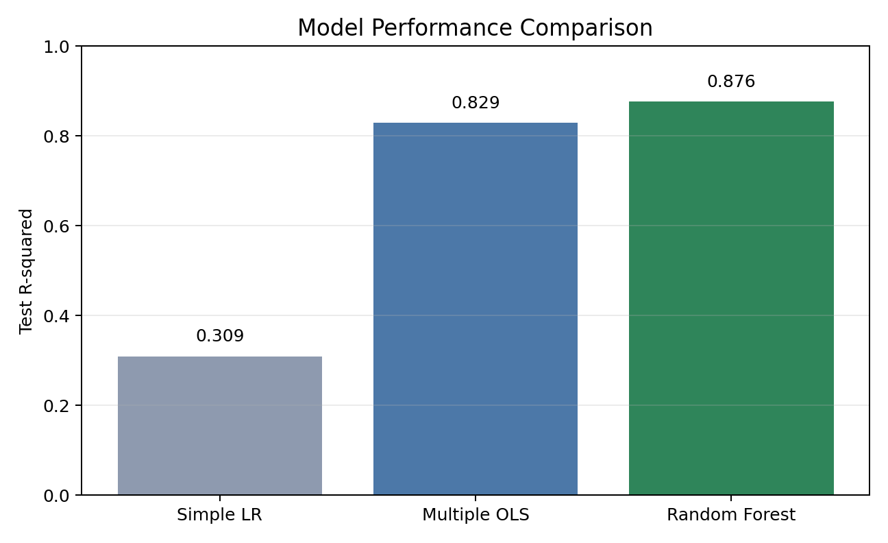
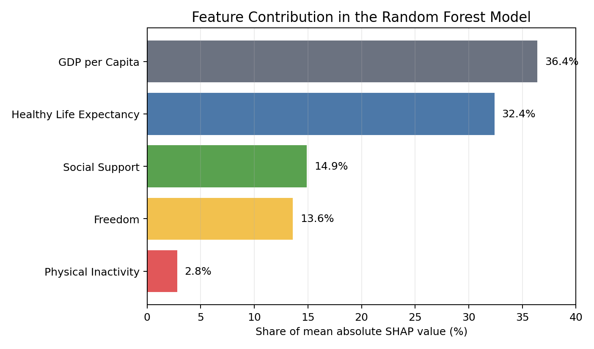
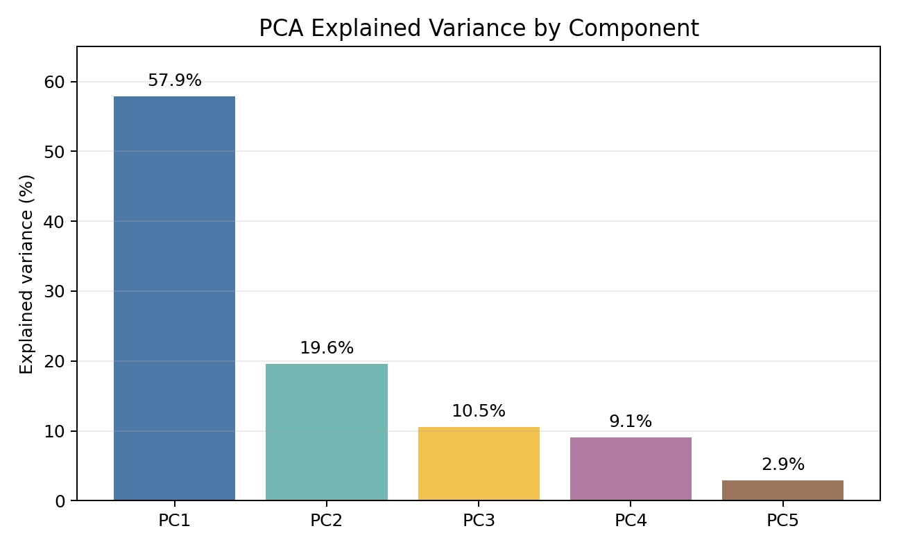

# Physical Inactivity and Happiness: Cross-Country Machine Learning Analysis

An evidence-led analysis of why physical inactivity and national happiness can appear positively associated across countries, using regression, tree ensembles, SHAP, K-Means, and PCA.

## Start here — the complete interactive report

### **[Open the complete interactive report →](https://bodhi584.github.io/physical-inactivity-happiness-ml/)**

This is the primary project experience and the recommended first review. It brings the research question, data, methodology, model comparisons, explainability, conclusions, figures, and interactive controls into one polished walkthrough.

> **Recommended path:** Explore the report first. If you want to reproduce or extend the analysis, open the notebook and run the code.

Then reproduce the analysis:

[](https://colab.research.google.com/github/bodhi584/physical-inactivity-happiness-ml/blob/main/notebooks/physical_inactivity_happiness_ml.ipynb)
&nbsp; [View the executed notebook](notebooks/physical_inactivity_happiness_ml.ipynb) · [View the report source](docs/index.html)



## At a Glance

| Scope | Evidence |
| --- | --- |
| Analytical sample | 152 countries after country-name harmonization |
| Modeling target | Mean national happiness score across available 2013-2023 observations |
| Final feature set | Adult inactivity, GDP contribution, social support, health, and freedom |
| Evaluation | Fixed 80/20 country split plus shuffled 5-fold cross-validation |
| Final explained model | Cross-validated Random Forest selected on the training split |
| Primary result | Held-out R-squared increased from 0.3093 with inactivity alone to 0.8763 with the final five-feature Random Forest |

The result is a model comparison, not evidence that inactivity causes happiness. Socioeconomic and health-related variables account for most of the predictive signal, while inactivity contributes relatively little to the final model.

## What I Built

- Harmonized country names across three public data files and created a reproducible 152-country analytical dataset.
- Engineered a five-feature modeling set from physical activity and well-being indicators.
- Compared simple and multiple linear regression, baseline and tuned Random Forest, and Gradient Boosting.
- Used SHAP to separate global model attribution from causal interpretation.
- Built K-Means country profiles and a five-component PCA analysis to show the full variance distribution.
- Packaged the complete workflow as an executed notebook that can be inspected without rerunning it.

## Results

### Model performance

All values below come from the same fixed 20% held-out country split (`random_state=42`).

| Model | Held-out R-squared | MAE | RMSE |
| --- | ---: | ---: | ---: |
| Inactivity-only linear regression | 0.3093 | 0.7546 | 0.9123 |
| Five-feature linear regression | 0.8292 | 0.3431 | 0.4537 |
| Baseline Random Forest | 0.8821 | 0.3026 | 0.3770 |
| Tuned Random Forest | 0.8763 | 0.3053 | 0.3861 |
| Tuned Gradient Boosting | 0.8750 | 0.3031 | 0.3881 |

The baseline Random Forest produced the highest score on this one test split. The tuned Random Forest was retained as the final explained model because its hyperparameters were selected through five-fold grid search on the training data; tuning did not improve the held-out score. Its post-selection shuffled five-fold R-squared averaged 0.823, which is supporting validation evidence rather than nested or external validation.

### SHAP model attribution



| Feature | Share of mean absolute SHAP |
| --- | ---: |
| GDP per capita contribution | 36.4% |
| Healthy life expectancy contribution | 32.4% |
| Social support | 14.9% |
| Freedom | 13.6% |
| Adult physical inactivity | 2.8% |

These percentages describe how the final Random Forest distributes prediction influence across features. They are not causal effect estimates.

### Country profiles and PCA



PC1 and PC2 explain 77.5% of standardized feature variance; all five components are retained in the figure so the remaining 22.5% is visible. The highest silhouette score occurred at `k=2` (0.374), while `k=3` was used for richer exploratory country profiling. Cluster labels therefore describe patterns in this feature space rather than definitive country categories.

## Method

1. Load the World Happiness and WHO country-profile files.
2. Harmonize country names and average the available 2013-2023 happiness observations.
3. Merge 2015 World Happiness explanatory contributions with WHO 2022 physical-activity indicators.
4. Clean numeric fields, derive average adult inactivity, and mean-impute missing inactivity values.
5. Compare regression and ensemble models using a fixed holdout and shuffled five-fold validation.
6. Explain the selected Random Forest with mean absolute SHAP values.
7. Standardize the five features for K-Means and PCA.

## Scope and Limitations

- This is an observational, country-level analysis. It does not identify individual-level or causal effects.
- The inputs are not temporally aligned: the target averages available 2013-2023 happiness values, the explanatory contribution columns come from the 2015 report, and physical-activity indicators come from WHO 2022 profiles.
- World Happiness explanatory columns are model-derived contribution measures, not raw socioeconomic measurements. Their structural relationship to happiness can make predictive fit appear stronger.
- Mean imputation of missing inactivity values preserves sample size but may reduce country-level variation.
- The sample contains 152 countries, and the held-out results depend on one random split. No external or out-of-distribution test set is included.
- The reported full-data cross-validation for the tuned ensemble is post-selection rather than nested cross-validation.

## Quick Start

The recommended route is the **Open in Colab** button at the top of this page. The notebook downloads the three public CSV files from this repository when they are not already present.

For a local run with Python 3.10-3.12:

```bash
git clone https://github.com/bodhi584/physical-inactivity-happiness-ml.git
cd physical-inactivity-happiness-ml
python3 -m venv .venv
source .venv/bin/activate
pip install -r requirements.txt
jupyter notebook notebooks/physical_inactivity_happiness_ml.ipynb
```

Saved outputs are included, so the analysis can also be reviewed directly on GitHub without executing the notebook.

## Repository Map

```text
.
├── data/           # Three required CSV files and provenance notes
├── docs/           # Complete interactive HTML report for GitHub Pages
├── figures/        # Three selected visuals supporting headline claims
├── notebooks/      # Final executed analysis and saved outputs
├── .gitignore
├── LICENSE
├── README.md
└── requirements.txt
```

## Data Sources and Reuse

- [WHO Global Status Report on Physical Activity 2022: Country Profiles](https://www.who.int/publications/i/item/9789240064119)
- [World Happiness Report 2015](https://worldhappiness.report/ed/2015/)
- [World Happiness Report data-sharing page](https://worldhappiness.report/data-sharing/) for the multi-year happiness series

The repository includes analysis-ready copies of the three inputs for reproducibility. Rights in those datasets remain with their providers, and their reuse is governed by the terms on the linked source pages. The MIT license in this repository applies to the original code and documentation only; it does not relicense third-party data.

## Skills Demonstrated

Data integration, feature engineering, regression diagnostics, cross-validation, hyperparameter tuning, ensemble learning, SHAP explainability, K-Means clustering, PCA, scientific visualization, and reproducible notebook delivery.
